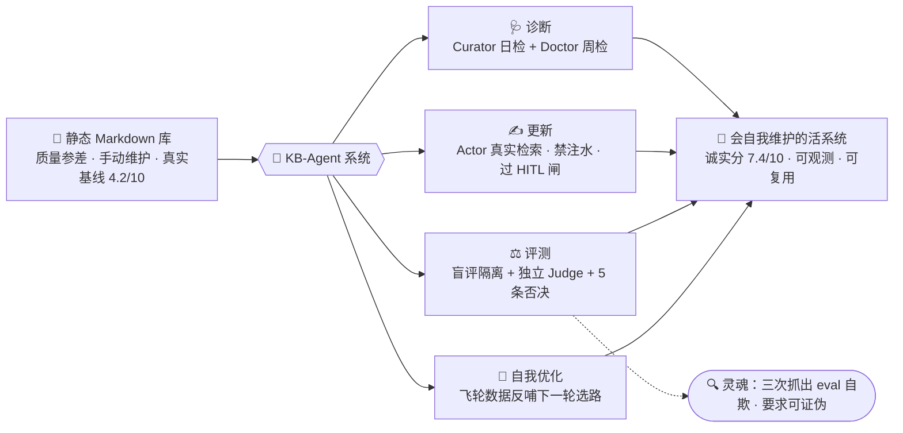
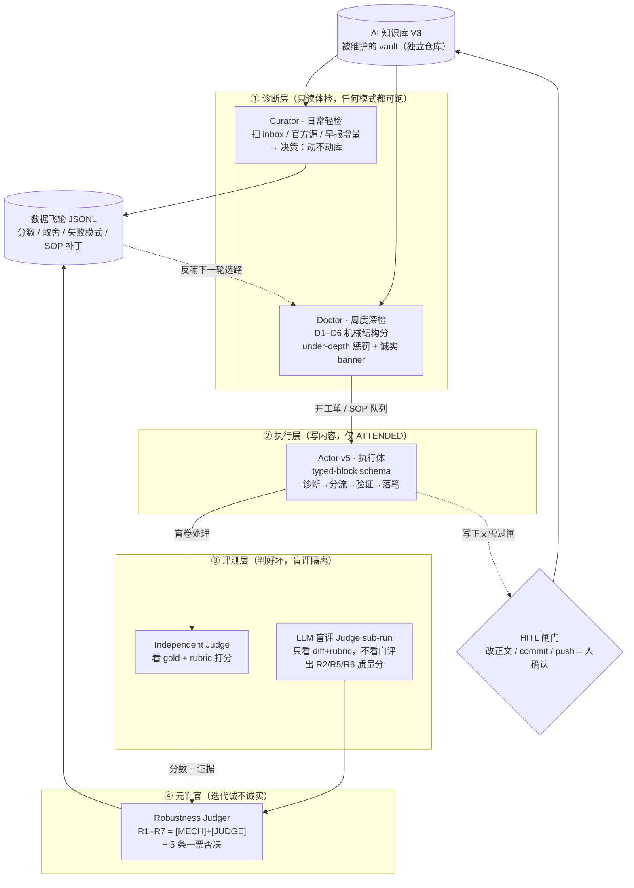
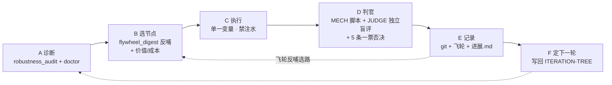

# KB-Agent · 一个会"自己维护、自己迭代、高鲁邦性"的知识库agent harness系统


> **一句话**：把一个静态的 Markdown 知识库，变成一个能**自主诊断 → 更新 → 评测 → 不断迭代**的agent系统——它最稀缺的能力不是"写内容"，而是**知道自己写得好不好、并且多层judge和self correction、自动化迭代**。
>
> 这是一个 **eval-first 的 AI Harness（multiagent 编排）项目**：不先写功能，先建评测；像训练模型一样用 dev/holdout 迭代 agent 本身；用**多个角色隔离、三层嵌套的 agent + 两条自动化 loop + 数据飞轮 + 多层judger和sop沉淀**把"维护知识库"这件事系统化。全程 git 可追溯、HITL 安全边界、SOP 可复用。

> **📢 公开版说明**：本仓库是**净化导出版（sanitized export）**。为保护**闭卷评测（blind eval）**的有效性，**刻意不含评测"答案键"**——完整标注数据集与 gold 答案不公开，只公开被测 agent 可见的**题目包** `evals/02-challenge-dataset-v0.4-actor-pack.md`。被维护的知识库本体（真实 vault）随私有仓库保存，但本仓库自带一个**最小可跑的示例 vault**（`examples/sample-vault/`，含一份 sanitized 的 `kb_ops.py`）与示例挑战集——**clone 下来即可真跑一遍**全部管线。个人作品叙事、截图、第三方捆绑不在公开范围。"不公开答案键"本身就是本项目"评测不作弊"原则的体现。

---

## 目录

1. [这是什么（30 秒电梯图）](#这是什么30-秒电梯图)
2. [为什么值得看：三次抓出评测在"自欺"](#为什么值得看三次抓出评测在自欺)
3. [完整复盘：这个系统是怎么长出来的（两个阶段）](#完整复盘这个系统是怎么长出来的两个阶段)
4. [系统架构：多 agent 全景](#系统架构多-agent-全景)
5. [五类 agent 角色详解](#五类-agent-角色详解)
6. [两条 Loop 详解](#两条-loop-详解)
7. [评测体系详解（eval-first 三件套）](#评测体系详解eval-first-三件套)
8. [评分体系（诚实评分 + 元层判官）](#评分体系诚实评分--元层判官)
9. [数据飞轮](#数据飞轮)
10. [成果数字](#成果数字可在-git-log--evalsruns-溯源)
11. [快速上手（可执行）](#快速上手可执行)
12. [仓库结构](#仓库结构)
13. [迁移到你自己的知识库（10 步）](#迁移到你自己的知识库10-步)
14. [安全模型与定时时钟](#安全模型与定时时钟)
15. [设计决策与教训](#设计决策与教训)

---

## 这是什么（30 秒电梯图）



**被维护的对象**是一个 Obsidian 知识库（`AI 知识库 V3`，独立私有仓库，服务"2026 秋招 AI PM"目标）。**本仓库是"维护它的那套系统"**——不是内容本身，是让内容持续变好的引擎。

---

## 为什么值得看：三次抓出评测在"自欺"

做 AI 产品，最难的从来不是让模型产出，而是**建立"怎么知道它做得好"的评测**。这个项目把这件事做到了极致，并且在过程中**三次抓出评测在"自欺"**——这是它最高价值的判断力证据：

| # | 现象 | 真相 | 纠正 |
|---|---|---|---|
| 1 | 历史行为分 **8.6** | 脚本里 `OVERRIDES` 字典**硬编码**答案（人先写好标准答案再给自己打分）| 改真实闭卷盲评 → 真实 **8.3** |
| 2 | 自动化 Doctor 打 **9.1** | **机械指标虚高**："板块标题字符串存在"即给满分，质量减半的档案也算满分 | 改诚实评分 → 真实 **6.6**（≈人工 6.8）|
| 3 | 某轮 actor 自评偏乐观 | 独立 LLM-Judge 盲评比自评低 **1.0** | 当场抓到自评乐观偏差，记入分差信号 |

> **铁证**：问题 2 里，同一 commit、同一库快照，飞轮 JSONL 中 1 分钟内出现 6.7 与 9.1 两个分——9.1 是被"调"出来的虚高分。

**"不相信漂亮数字、要求可证伪"——这是本项目的灵魂。** 这正是 **Goodhart 定律**（"指标一旦成为目标就不再是好指标"）在 AI 产品里的活案例。整套系统的每一个设计（机械分/质量分物理分离、盲评隔离、独立判官、5 条一票否决）都是为了对抗这一点。

---

## 完整复盘：这个系统是怎么长出来的（两个阶段）

这个系统不是一次设计出来的，而是分两个阶段**长**出来的。理解这两段，就理解了整套架构的由来。

### 阶段一 · 建地基：从 baseline 到"会评分的 Doctor+Actor 闭环"

> 目标：把一个真实基线 4.2/10 的静态库，第一次系统化地更新一遍，并在此过程中**先把评测建起来**。

1. **诊断 baseline**：对已有静态知识库做首次体检，诚实基线 **4.2/10**（结构散、时效乱、与求职目标错位）。
2. **建评测体系（eval-first，全项目地基）**——先评测，再动手：
   - **黄金数据集**：对标 11 个顶尖知识库（Lilian Weng / Simon Willison / AI News / 拾象 …），提炼"顶尖靠什么取胜"的可复用选择判据 `SL-01~10`。
   - **挑战数据集**：100 条 harness 级真实场景（传闻核实、翻译失真、厂商自评、撤稿、跨库路由等刁钻判断题），拆 `smoke / regression / holdout` 等 split，**actor 输入包与 gold 答案物理隔离**。
   - **双维 rubric**：状态评测（给库快照打分）+ 行为评测（给 agent 单次处理打分）。
3. **把 Actor 当模型来训（v1 → v5）**：每轮 blind actor + independent judge + integrator 三段式盲评；用 dev/holdout 防过拟合。**v5 综合 8.94，dev 8.98 / holdout 8.82，gap 仅 0.16**（真泛化，非背题）。actor 的输出从粗放字段进化到 **typed blocks**（结构化 schema，见 [评测体系](#评测体系详解eval-first-三件套)）。
4. **数据驱动的失败模式分析**：每轮把评测结果**归因到单一主因**（prompt / SOP / 工具 / 数据 / rubric 五选一），一次只改一类变量再重测（`evals/analysis/` 里逐版本留档）。
5. **让 Doctor 会评分 + 开工单**：Doctor（`kb_ops.py`）对库做结构化体检打分（D1–D6），把低分维度写进 **SOP 修正队列**。
6. **Doctor × Actor 自愈闭环，第一次真更新库**：Doctor 诊断出工单 → Actor 执行（结构规范化、转载/版权治理、7 家目标公司从业者级档案、411 条双链 0 断链）→ Doctor 复核验收。库状态分从 4.2 持续提升。

**阶段一交付**：一套评测体系 + 一个到 v5 的 actor + 一个会评分开工单的 Doctor + 第一次系统化更新后的知识库。

### 阶段二 · 长出自主性：从"单库维护"到"会自评的自主系统"

> 目标：让这套东西**能自己一轮一轮跑下去、还能自己判断自己诚不诚实**（对应迭代 Round 1–10）。

1. **加第四类 agent：独立 LLM 盲评 Judge**（`evals/llm-judge-subrun.md`）。它专评"迭代过程本身诚不诚实"的 `[JUDGE]` 维度，**只看本轮 git diff + rubric、不读 actor 自评**——让**无人值守的时钟也能出质量分**，而不只是机械门分。
2. **诚实评分改造（第三次抓 eval 自欺就在这里）**：把 Doctor 的机械分与质量分**物理分离**，加 under-depth 惩罚、质量维度封顶、报告顶部强制打"机械分≠质量分"banner。
3. **建自主 Loop（A→B→C→D→E→F）**：一段自包含、可复用的执行剧本（`work/AUTONOMOUS-LOOP-PROMPT.md`），任何新会话/定时任务读到它就能在**不依赖历史对话记忆**下安全推进一整轮。
4. **建元层判官（Robustness Judger）**：`evals/robustness-judge.md` 的 R1–R7 rubric，把维度分成 `[MECH]`（脚本客观算）和 `[JUDGE]`（LLM/人工带证据打分），外加 **5 条一票否决**（自欺/注水/虚高/越界/不可恢复）。
5. **建数据飞轮闭环**：把每轮的分数序列/取舍决策/失败模式/SOP 补丁写进飞轮 JSONL，并让 `flywheel_digest.py` **真正读它**产出"下一轮聚焦建议"——数据反哺选路，不是只记录。
6. **快变事实检查 + 主动信息管线 + 泛化验证**：volatile stale-checker（融资/估值/股价/模型版本 14 天短窗口）、curator 主动扫外部早报增量、把整套框架只读迁到"具身智能"库验证 60/30/10 可复用。

**阶段二交付**：一个多 agent、双 loop、带数据飞轮、有 HITL 安全边界、能自评诚实性、可无人续跑、可迁移到新主题的**自主维护系统**。

---

## 系统架构：多 agent 全景

整个系统由 **5 类角色隔离的 agent** + **1 个数据飞轮** + **1 道 HITL 闸门**组成，围绕被维护的 vault 运转：



| 层 | Agent | 什么时候跑 | 会不会改知识正文 |
|---|---|---|---|
| ① 诊断 | **Curator** | 每日（launchd 09:10）| ❌ 只体检、只出报告 |
| ① 诊断 | **Doctor** | 每周（launchd 周一 20:30）| ❌ 只体检、只出报告 |
| ② 执行 | **Actor** | 仅 ATTENDED（用户在场）| ✅ 但必须过 HITL 闸 + 真实检索 |
| ③ 评测 | **Independent Judge** | 每次 eval run | ❌ 只读 actor 产出 + gold |
| ③ 评测 | **LLM 盲评 Judge** | 每轮收口（含无人值守）| ❌ 只读 diff |
| ④ 元层 | **Robustness Judger** | 每轮收口 + 每次定时任务 | ❌ 只评分 |

---

## 五类 agent 角色详解

这是理解本系统的核心：**每个 agent 只能看什么、产出什么、被什么边界隔离**。角色隔离是"评测不作弊"的物理保证。

### 1. Curator（日常轻检 · 信息雷达）
- **职责**：每天扫 `_meta/inbox/`、官方源 hash 变化、外部 `AI-HOT早报/` 增量，**判断"今天值不值得动库"**，输出一个决策（`no_library_update` / `candidate_review_required` / `repair_required` / `refresh_required`）。
- **只读**：库文件 + 官方源 URL（可选 `--fetch`）+ 早报目录。
- **产出**：`_meta/reports/<date>-curator-light.md` + 飞轮记录。**不入库**——新信息只进 `candidate_review`，摆脱"用户是唯一信息泵"。
- **实现**：`kb_ops.py curator`。

### 2. Doctor（周度深检 · 诚实评分器）
- **职责**：对库做结构/时效/元数据/双链/自动化的深度体检，打 **D1–D6 机械结构分**，把 <7.0 的维度写进 SOP 修正队列。
- **诚实设计**：机械分与质量分**物理分离**；D2 含 under-depth 惩罚（某档案 < 同类中位数 60% 即扣分）；D5 可面试性**封顶 7.0** 且要求真实面试块（不再"标题存在即满分"）；报告顶部强制 banner：*"本分是机械结构门分，不代表内容质量。"*
- **只读**：库文件 + git 状态。**产出**：`<date>-doctor-weekly.md` + `score-timeseries.jsonl` + `sop-patches.jsonl`。
- **实现**：`kb_ops.py doctor`。

### 3. Actor（执行体 · 唯一会写正文的 agent）
- **职责**：接 Doctor 的工单，对每条输入做"诊断→分流→验证→落笔"，把判断落到**可核查的 typed 字段**上（见 [schema](#actor-的-typed-block-schema)）。
- **盲评隔离（铁律）**：做行为评测时，Actor **只能读** `actor-pack`（题目包）、prompt、README、协议、rubric、failure-patterns；**禁读** gold 答案、jsonl、`runs/*`、任何含 `OVERRIDES/score/verdict` 的材料。把答案带进 actor 上下文 → 该轮判无效。
- **安全边界**：只有 ATTENDED（用户在场）才可写知识正文，且写库必须过 HITL 闸、必须真实来源检索、**禁注水/占位/编造**。
- **实现**：`evals/prompts/agent-v5.md`（prompt 即实现，运行时 = Claude Code）。

### 4. Independent Judge / LLM 盲评 Judge（两个评分器）
- **Independent Judge**（行为评测打分）：读 `actor-output.jsonl` + gold + rubric + 校准集，写 `manifest/results/report`。**与 actor 物理隔离**——甚至 actor 的输出 schema 用 JSON-Schema 的 `not` 子句**禁止**出现 `scores/weighted/verdict/judge_evidence/expected_action` 字段。
- **LLM 盲评 Judge sub-run**（质量分）：只评 `[JUDGE]` 维度（R2 评测诚实 / R5 深度诚实 / R6 归因），**只看本轮 diff + rubric、不读 actor 自评**；评完再读自评算分差，`|Δ|>1.5` → 标"需人复核"。这让**无人值守时钟也能出质量分**。
- **实现**：`run_blind_eval.py`（准备/校验 harness）+ `evals/llm-judge-subrun.md`（盲评剧本）。

### 5. Robustness Judger（元层判官 · 评"迭代本身诚不诚实"）
- **职责**：每轮收口时回答"这个系统是不是在真的变好、有没有在自欺、能不能无人续跑"。R1–R7 七维，`[MECH]` 维度由 `robustness_audit.py` 客观算，`[JUDGE]` 维度必须带证据打分。
- **5 条一票否决**：自欺 / 注水 / 虚高 / 越界 / 不可恢复——任一触发，该轮**不许标 DONE**，综合分作废。
- **实现**：`evals/robustness-judge.md`（rubric）+ `evals/robustness_audit.py`（`[MECH]` 客观脚本，**故意拒绝**给 `[JUDGE]` 维度机械代打）。

---

## 两条 Loop 详解

### Loop ① · 评测驱动的 Actor 迭代（阶段一，训 agent）

像训练模型一样迭代 actor，直到泛化达标：

```
建挑战集/rubric → 准备盲评包 → Actor 隔离盲卷 → Independent Judge 打分
      ↑                                                      │
      └──── 失败模式归因(单一变量) ←── dev/holdout 防过拟合 ←──┘
```

产物：`agent-v1…v5.md`、`evals/analysis/*失败模式分析*`、`evals/baselines/actor-v5-production-candidate.json`（v5 基线冻结）。

### Loop ② · 自主维护循环 A→B→C→D→E→F（阶段二，跑系统）

每一轮迭代走 6 步，flywheel 数据反哺下一轮选路（详见 `work/AUTONOMOUS-LOOP-PROMPT.md`）：



- **A 诊断**：`robustness_audit.py`（客观机械分）+ `kb_ops.py doctor`（库体检，只体检不改正文）。
- **B 选节点**：`flywheel_digest.py` 读历史飞轮（分数趋势/慢性弱项/积压候选）产出"下一轮聚焦建议"，叠加 `ITERATION-TREE.md` 的"价值/成本"选路——**数据反哺决策，不是拍脑袋**。
- **C 执行**：一次只改一类变量（prompt/SOP/工具/数据/rubric 五选一）；改内容必须真实检索、禁注水。
- **D 判官**：`[MECH]` 用脚本；`[JUDGE]`（R2/R5/R6）跑独立 LLM 盲评 sub-run；检查 5 条一票否决。
- **E 记录**：git 原子提交 + 飞轮 JSONL + `进展.md §7` 迭代日志。
- **F 定下一轮**：用同一选路规则在节点树选下一个，写进"下一轮方向"。

---

## 评测体系详解（eval-first 三件套）

**不先写功能，先建评测**——这是全项目的地基。三件套：

| 件 | 是什么 | 作用 | 文件 |
|---|---|---|---|
| 🥇 **黄金数据集** | 对标 11 个顶尖知识库提炼的选择判据 `SL-01~10` | 定义"10 分长什么样" | `evals/01-golden-dataset-candidates.md` · `research/golden-kb-study/` |
| 🎯 **挑战数据集** | 100 条 harness 级真实场景，拆 smoke/regression/holdout | 定义"刁钻场景怎么判" | `evals/02-challenge-dataset-v0.4-actor-pack.md`（题目包，公开）· gold 答案键（私有）|
| 📐 **双维 rubric** | 状态评测（库快照）+ 行为评测（agent 单次处理）| 定义"好不好怎么量" | `evals/03-rubric-v2.0.md` |

**盲评隔离怎么落地**：`run_blind_eval.py prepare` 生成一个任务包——给 actor 的 `actor-task.md` 明确列出**可读文件**与**禁读文件**（gold/jsonl/runs/OVERRIDES 全禁），并把 case 里的答案字段 `safe_actor_case()` 剥掉；judge 在**另一个隔离会话**里才读 gold。

**防过拟合**：challenge 集拆 dev/holdout，holdout 绝不用于调 prompt；`dev–holdout` 分差 >1.0 触发过拟合警报。**v5 gap 仅 0.16**。

### Actor 的 typed-block schema

Actor 输出不是自由文本，而是**类型化字段**（`evals/schemas/actor-output.schema.json`，v5 必填 30+ 字段）。核心字段举例：

```yaml
decision:        accept_main | accept_private | ops_only | candidate | verify | reject | human_review
target_zone:     AI_PM_core | company_dossier | theory | benchmark | tool_method | source_log | ops_protocol | private_profile | none
source_grade:    A | B | C | D | F          # 信源置信度分级
provenance:      { source_url, source_title, accessed_at, evidence_status: primary|secondary|user_report|... }
risk_tier:       low | medium | high | blocking
user_gate:       none | notify | ask_before_write | block   # 人审闸门
pm_transfer_score: { interview_expression, company_research, product_decision, reusable_method }  # 0/1
failure_mode:    []      # 本条暴露的失败模式，喂回飞轮
```

> Schema 用 JSON-Schema 的 `not` 子句**硬性禁止** actor 输出 `scores/weighted/verdict/judge_evidence/expected_action`——把"评分权"从 actor 手里在类型层面拿走，杜绝自评自判。

---

## 评分体系（诚实评分 + 元层判官）

系统有**两套正交的评分**，分别回答不同问题：

### Doctor 评分：库快照好不好（D1–D6，机械结构门分）

| 维度 | 权重 | 诚实设计 |
|---|---:|---|
| D1 结构与导航 | 25% | 断链数惩罚 |
| D2 内容覆盖 | 25% | **含 under-depth 惩罚**：某档案 < 中位数 60% 即扣，防"7 家都在但半深度" |
| D3 时效与事实纪律 | 15% | 过期/临期 + volatile 快变事实惩罚 |
| D4 元数据规范 | 5% | frontmatter 必填字段 |
| D5 可面试/可行动性 | 25% | **封顶 7.0** 且需真实面试块，`requires_judge` |
| D6 自动化与飞轮 | 5% | 自动化产物齐全度 |

> `D2/D5` 明确标 `requires_judge`——机械分只做"能不能进闸"的门，"好不好"的判决交 LLM/人工。

### Robustness 评分：迭代过程诚不诚实（R1–R7，元层）

| 维度 | 权重 | 类型 |
|---|---:|---|
| R1 状态可恢复性 | 15% | `[MECH]` |
| **R2 评测诚实性** | **25%** | `[JUDGE]`（项目命门）|
| R3 可追溯性 | 15% | `[MECH]` |
| R4 安全边界合规 | 15% | `[MECH]` |
| R5 内容深度诚实 | 15% | `[JUDGE]` |
| R6 归因有效性 | 10% | `[JUDGE]` |
| R7 泛化/可复用 | 5% | `[MECH]` |

**5 条一票否决**（任一触发即"评分不可信"）：① 自欺（`[JUDGE]` 维度用机械代理打满分）② 注水（凑数量/行数复读占位编造）③ 虚高（漂亮综合分但答不出"怎么算的、能否证伪"）④ 越界（无人值守改了正文/自动 commit）⑤ 不可恢复（改了系统但没更新进展.md，新会话续不上）。

---

## 数据飞轮

每轮都往被维护 vault 的 `_meta/flywheel/` 喂这些 JSONL 信号，并**真正读取**它们反哺下一轮：

| 文件 | 记录什么 |
|---|---|
| `score-timeseries.jsonl` | 分数序列（机械分 / 质量分分开记）|
| `candidate-decisions.jsonl` | 每次"动不动库"的取舍决策 |
| `run-events.jsonl` | 每次运行的心跳事件 |
| `sop-patches.jsonl` | Doctor 自动写的 SOP 修正（反复出现=慢性弱项）|
| `user-feedback.jsonl` · `manual-diff-signals.jsonl` | 用户反馈 / 手动编辑偏好信号 |

`flywheel_digest.py` 读这些 → 输出"下一轮聚焦建议"（回归维度/慢性弱项/积压候选）。**首跑即得真信号**：D5 可面试性被 SOP 队列标记 6 次 = 慢性弱项 → 数据独立指向"该建面试题库"，下一轮就去做。这就是飞轮真的在转。

---

## 成果数字（可在 git log / evals/runs 溯源）

- **Agent 行为分** v2→v5：8.3 → **8.94**（真实盲评，holdout gap 仅 **0.16** = 真泛化非背题）。
- **知识库诚实分**：初诊 **4.2** →（诚实基线）6.6 → **7.4**（随真实深度自然升，非调分）。
- **内容深度**：**7/7 目标公司深度档案** + **横向对比矩阵** + **44 题 AI PM 面试题库**（8 通用 + 7×4 公司特异）。
- **结构质量**：全库 **411 条双链 · 0 断链**，frontmatter 规范、转载/版权治理。
- **迭代诚实性**：**10 轮自主迭代，5 条一票否决全 PASS、零注水**。
- **可复用资产**：3 份 topic 无关 SOP + 可迁移评测框架 + 独立 LLM-Judge + 飞轮反哺（具身库验证 60% 零改动复用）。

---

## 快速上手（可执行）

> **依赖**：Python 3.9+、git。**零第三方依赖**（脚本纯标准库）。
> **✅ clone 即可跑**：本仓库自带示例 vault（`examples/sample-vault/`）与示例挑战集，下列命令在全新 clone 上都能直接产出真实输出。三个"库侧"脚本按 `$KB_VAULT` → 同级私有 vault → 内置 `examples/sample-vault` 的顺序自动定位库。完整 gold 答案集刻意不公开（保护闭卷评测）。

```bash
# ① 客观机械审计（R1/R3/R4/R7，[MECH] only；故意拒绝给质量维度打分）
python3 evals/robustness_audit.py            # 人读报告（默认落到示例 vault）
python3 evals/robustness_audit.py --json     # 机读 JSON

# ② 飞轮 digest → 下一轮聚焦建议（读示例飞轮数据，能看到真实趋势/慢性弱项）
python3 evals/flywheel_digest.py

# ③ 库体检（Doctor 机械结构分，只体检不改正文，产出周报 + dashboard）
python3 examples/sample-vault/_meta/pipeline/kb_ops.py doctor --force

# ④ 日常轻检 + 自主决策 + 重建 dashboard（--fetch 会拉官方源比对 hash）
python3 examples/sample-vault/_meta/pipeline/kb_ops.py run

# ⑤ 准备一次盲评 run（三段式，角色隔离；gold 字段会被自动剥除）
python3 evals/run_blind_eval.py prepare --actor agent-v5 --split smoke,regression \
    --dataset examples/sample-challenge.jsonl
#   → 在【隔离会话 A】跑 actor：只读 actor-pack，禁读 gold，写 runs/<id>/actor-output.jsonl
#   → 在【隔离会话 B】跑 judge：读 gold+rubric，写 runs/<id>/{manifest,results,report}
python3 evals/run_blind_eval.py status --run-dir evals/runs/<run_id>   # 查看包状态
# actor+judge 两个模型步骤跑完后再校验：
python3 evals/run_blind_eval.py validate --run-dir evals/runs/<run_id>

# ⑥ 独立 LLM 盲评 sub-run（[JUDGE] 质量分，让无人值守也能出质量分）
#   按 evals/llm-judge-subrun.md 另起独立步骤：只看本轮 git diff + rubric，不读 actor 自评

# 指向你自己的库：
KB_VAULT=/path/to/your-vault python3 evals/flywheel_digest.py
```

> 更多试跑说明见 [`examples/README.md`](examples/README.md)。`validate/finalize` 需先在隔离会话跑完 actor 与 judge 两个模型步骤。
>
> **跑一整轮自主迭代**：把 `work/AUTONOMOUS-LOOP-PROMPT.md` 交给一个新的 Claude Code 会话即可，它会按 A→F 自包含执行、边做边落盘。

---

## 仓库结构

```
KB-Agent/                              ← 本仓库 =「维护知识库的那套系统」（公开净化导出）
├── 进展.md                            ← 进度真相源（新会话/定时任务开工必读）
├── STATUS-*.md                        ← 时点详细快照
├── DECISIONS.md                       ← 决策日志（模型选择/安全方案/流程教训）
├── work/
│   ├── ITERATION-TREE.md              ← 优先级+依赖的节点树（选路规则）
│   └── AUTONOMOUS-LOOP-PROMPT.md      ← 自包含可复用循环剧本（ATTENDED/UNATTENDED）
├── protocols/                         ← 00 总纲 + context / tool / human-review 三大运行协议
├── evals/                             ← 评测体系（全项目地基）
│   ├── 02-challenge-dataset-v0.4-actor-pack.md ← 挑战集「题目包」（actor 可见）
│   │                                              gold 答案键不在公开导出内
│   ├── 03-rubric-v2.0.md                     ← 状态×行为双维评测标准
│   ├── prompts/agent-v1…v5.md               ← Actor prompt 迭代史
│   ├── schemas/actor-output.schema.json     ← typed-block 结构化输出契约
│   ├── robustness_audit.py                  ← 元层客观机械审计（[MECH] only，可直接跑）
│   ├── robustness-judge.md                  ← 元层鲁棒性 rubric（R1-R7 + 5 否决）
│   ├── llm-judge-subrun.md                  ← 独立 LLM 盲评 sub-run（出质量分）
│   ├── analysis/                            ← 逐版本失败模式分析
│   └── runs/                                ← 每轮评测/判官的结构化产物
├── research/golden-kb-study/          ← 11 个顶尖知识库标杆深度研读
├── visualizer/                        ← dashboard / protocol lint 构建
└── examples/                          ← ✅ clone 即可跑的 demo
    ├── sample-vault/                  ← 最小知识库 + 内置 sanitized kb_ops.py + 示例飞轮
    └── sample-challenge.jsonl         ← 4 条合成挑战题（演示盲评隔离，gold 会被剥除）

真实被维护的 vault（独立私有仓库，不在本导出内；其 _meta/ 布局与 examples/sample-vault 一致）
└── _meta/pipeline/kb_ops.py           ← Curator+Doctor+Dashboard 管线（stdlib-only）
    _meta/flywheel/*.jsonl             ← 数据飞轮
    _meta/sop/SOP-01…03.md            ← 3 份 topic 无关 SOP
    _meta/automation/launchd/*.plist   ← 定时任务（curator 日 / doctor 周）
```

---

## 迁移到你自己的知识库（10 步）

整套 harness **topic 无关**。给任意新主题知识库接入：

1. `git init` 你的库（获得可观测/可回滚）。
2. 建 `_meta/` 脚手架（pipeline / reports / flywheel / sources / dashboard / sop）。
3. 迁 SOP（结构规范复用，公司/实体清单换成你的主题）。
4. 迁管线 `kb_ops.py`（改 `VAULT` 路径、必填 frontmatter、volatile 字段）。
5. 迁诚实评分（under-depth 惩罚 + 质量维度封顶 + banner 直接留用）。
6. 迁判官（`robustness-judge.md` + `robustness_audit.py`，改路径/阈值）。
7. 迁循环 `AUTONOMOUS-LOOP-PROMPT.md`（改 vault 路径变量）。
8. **建你主题的评测集**（该领域刁钻判断题 + 黄金标杆）——唯一必须从零做的部分。
9. 接定时任务（UNATTENDED 只体检）。
10. 建 `进展.md` + `ITERATION-TREE.md` 作为进度真相源。

> 实证：把这套迁到"具身智能"知识库，**60% 资产零改动复用 / 30% 换清单 / 10% 重建**（`research/N7-reuse-validation-embodied.md`）。

---

## 安全模型与定时时钟

**为什么它敢自动跑**——因为不可逆动作永远留人审：

- **ATTENDED（你在场）**：可改知识正文、可本地原子 commit（git 可回滚），但**不 push / 不开源**。
- **UNATTENDED（定时任务）**：**只诊断 / 研究 / 准备候选 / 上报**，绝不改正文、不自动 commit、不对外发布。默认从严——**拿不准就当 UNATTENDED**。
- **HITL（人确认）**：开源、删除、push、改权限、发消息等对外/不可逆动作，必须用户在场确认。
- **密钥**：API key 永不进对话/日志/文件/git。

**定时时钟**：
- launchd：Curator 每日 09:10 / Doctor 每周一 20:30（只体检）。
- scheduled-task：每周一次"鲁棒性 + 进度推进"loop（UNATTENDED），跑 `AUTONOMOUS-LOOP-PROMPT.md`。
- 每次定时结束都在 `进展.md §7` 留一条带日期的记录，保证可观测。

---

## 设计决策与教训

几条最值得记的权衡：

| 权衡 | 选择与理由 |
|---|---|
| eval-first vs 直接开干 | 选前者：慢，但避免在假信号上迭代——全项目最值的决策 |
| 硬编码占位 vs 真实评测 | 占位能先跑通管线，但制造"已经很强"的假象；必须换真实闭卷 |
| 自动化程度 vs 安全 | 自动化只体检+出报告，**绝不自动改正文/自动 commit**——HITL 优先于全自动 |
| 机械指标 vs 质量 rubric | 机械分能自动化但会虚高；质量必须靠带证据的 rubric（这就是"三次抓 eval 自欺"的由来）|
| 覆盖广度 vs 单篇深度 | 7 家都覆盖后发现后 3 家深度减半——"完成的定义"要绑质量而非数量 |

---

## 注

我是这个 agent 系统的 PM，也是它的用户。做它是为了回答一个我认为 AI PM 时代最核心的问题：**当模型能写任何东西时，"判断好坏 + 不被漂亮数字骗"就成了最稀缺的能力。** ，hallucination is foundation，弹性地用管理学创造ai native的产品，并用生产力场景来真实的验证它，是我把自身的world model和reality不断对齐的一次探索，共勉。

---

*License: MIT · 数字均可在 git log / `evals/runs/` 中溯源核对。*
