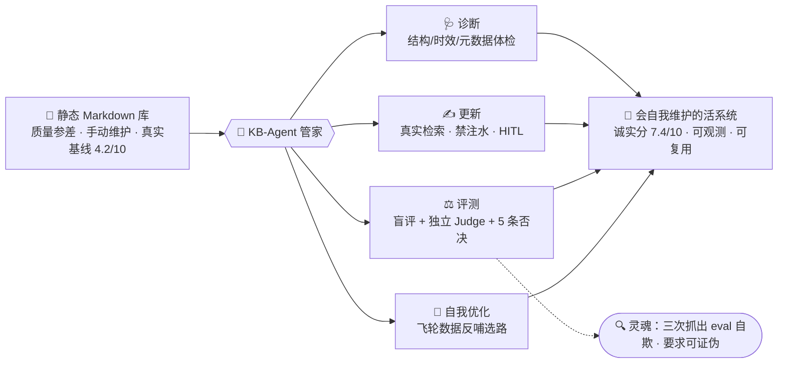
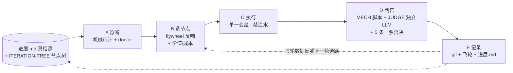

# KB-Agent · 一个会"自己维护自己"的 AI 知识库管家


> **一句话**：把一个静态的 Markdown 知识库，变成一个能**自主诊断 → 更新 → 评测 → 自我优化**的活系统——而且它最稀缺的能力不是"写内容"，是**知道自己写得好不好、并且不自欺**。
>
> 这是一个 **eval-first 的 AI Harness / agent 编排项目**：不先写功能，先建评测体系，像训练模型一样用 dev/holdout 迭代 agent 本身。全程 git 可追溯、HITL 安全边界、SOP 可复用、数据飞轮反哺。

> **📢 公开版说明**：为保护**闭卷评测（blind eval）**的有效性，本公开版**刻意不含评测"答案键"**——完整标注数据集与 Judge 答案包不公开，只公开被测 agent 可见的**题目包** `evals/02-challenge-dataset-v0.4-actor-pack.md`。公开答案会让任何模型背题、使 benchmark 失效——"不公开答案键"本身就是本项目"评测不作弊"原则的体现。个人作品叙事、截图、第三方捆绑亦不在公开范围。

---

## 这是什么（30 秒电梯图）



---

## 为什么值得看一眼

做 AI 产品，最难的从来不是让模型产出，而是**建立"怎么知道它做得好"的评测**。这个项目把这件事做到了极致，并且在过程中**三次抓出评测在"自欺"**：

1. 历史行为分 8.6 → 打开脚本发现是**硬编码**答案（人先写好标准答案再给自己打分）→ 改真实闭卷盲评，真实分 8.3。
2. 自动化 Doctor 打 9.1 → 核查发现是**机械指标虚高**（"板块标题存在"即给满分）→ 改诚实评分，真实 6.6（≈人工 6.8）。
3. 独立 LLM-Judge 复评某轮，比 actor 自评低 1.0 → **当场抓到自评乐观偏差**。

**"不相信漂亮数字、要求可证伪"——这是本项目的灵魂，也是它认为 AI PM 最值钱的判断力。** 这正是 Goodhart 定律（"指标一旦成为目标就不再是好指标"）在 AI 产品里的活案例。

---

## 它是怎么运转的（核心 Loop）

每一轮迭代走 **A→B→C→D→E**，flywheel 数据反哺下一轮选路：



- **A 诊断**：`robustness_audit.py`（客观机械分）+ `kb_ops.py doctor`（结构/时效/元数据体检，只体检不改正文）。
- **B 选节点**：`flywheel_digest.py` 读历史飞轮数据（分数趋势、慢性弱项、积压候选）产出"下一轮聚焦建议"，叠加节点树的"价值/成本"选路——**数据反哺决策，不是拍脑袋**。
- **C 执行**：一次只改一类变量（prompt/SOP/工具/数据/rubric 五选一），改内容必须**真实来源检索、禁注水**。
- **D 判官**：`[MECH]` 维度用脚本客观算；`[JUDGE]` 维度（评测诚实/深度诚实/归因）交给**独立 LLM 盲评 sub-run**（只看 diff+rubric、不读 actor 自评），并追踪自评 vs 独立评的分差；**5 条一票否决**（自欺/注水/虚高/越界/不可恢复）任一触发即判该轮不可信。
- **E 记录**：git 原子提交 + 飞轮 JSONL + 进展.md 迭代日志，全程可观测可回滚。

---

## 核心特性

| 特性 | 说明 |
|---|---|
| 🎯 **Eval-first** | 100 条 harness 级挑战集（actor/gold 答案物理隔离）+ 状态×行为双维 rubric + dev/holdout 防过拟合（v5 holdout gap 仅 0.16 = 真泛化非背题）|
| 🧭 **诚实评分** | 机械分与质量分**物理分离**；覆盖率/字符串匹配**不许冒充质量**；报告带"机械分≠质量分"banner |
| ⚖️ **鲁棒性判官** | 系统级 rubric（R1-R7）+ 独立 LLM-Judge + 5 条一票否决，评的是"迭代过程本身诚不诚实" |
| ⏱️ **快变事实检查** | 公司档案的融资/估值/股价/模型版本用短窗口 volatile 队列，防"看着不 stale 其实早过时" |
| 📡 **主动信息管线** | curator 自动扫描外部早报增量作为候选（不自动入库，走人审），摆脱"用户是唯一信息泵" |
| 🔁 **数据飞轮闭环** | 收集的分数序列/取舍决策/失败模式**被真正读取**用于反哺下一轮选路，而非只记录 |
| 🛡️ **HITL 安全边界** | 无人值守只体检/研究/上报，**绝不自动改正文、不自动 commit、不对外发布**；ATTENDED/UNATTENDED 双模式 |
| ♻️ **topic 无关可复用** | SOP + 评测框架 + judger + loop 可迁移到任意新主题知识库（约 60% 资产零改动复用，见迁移 checklist）|

---

## 成果（可在 git log / evals/runs 溯源）

- **Agent 行为分** v2→v5：8.3 → **8.94**（真实盲评，holdout gap 仅 **0.16** = 真泛化非背题）。
- **知识库诚实分**：初诊 **4.2** →（诚实基线）6.6 → **7.4**（随真实深度自然升，非调分）。
- **内容深度**：**7/7 目标公司深度档案** + **横向对比矩阵** + **44 题 AI PM 面试题库**（8 通用 + 7×4 公司特异）。
- **结构质量**：全库 **411 条双链 · 0 断链**，frontmatter 规范、转载/版权治理。
- **迭代诚实性**：**10 轮自主迭代，5 条一票否决全 PASS、零注水**。
- **可复用资产**：沉淀 **3 份 topic 无关 SOP** + 一套可迁移评测框架 + 独立 LLM-Judge + 飞轮反哺。

---

## 拉下来给你自己的知识库用（10 步迁移）

这套东西 **topic 无关**。给任意新主题知识库接入：

1. `git init` 你的库（获得可观测/可回滚）
2. 建 `_meta/` 脚手架（pipeline/reports/flywheel/sources/dashboard/sop）
3. 迁 SOP（结构规范复用，公司/实体清单换成你的主题）
4. 迁管线 `kb_ops.py`（改 VAULT 路径、必填 frontmatter、volatile 字段）
5. 迁诚实评分（under-depth 惩罚 + 质量维度封顶 + banner 直接留用）
6. 迁判官（`robustness-judge.md` + `robustness_audit.py`，改路径/阈值）
7. 迁循环 `AUTONOMOUS-LOOP-PROMPT.md`（改 vault 路径变量）
8. **建你主题的评测集**（该领域刁钻判断题 + 黄金标杆）— 唯一必须从零做的部分
9. 接定时任务（UNATTENDED 只体检）
10. 建 `进展.md` + `ITERATION-TREE.md` 作为进度真相源

> 详见 `research/N7-reuse-validation-embodied.md`（把这套迁到"具身智能"知识库的实证：60% 零改动复用 / 30% 换清单 / 10% 重建）。

---

## 仓库结构

```
KB-Agent/
├── 进展.md                          ← 进度真相源（新会话/定时任务开工必读）
├── PROJECT-SUMMARY.md               ← 叙事级复盘（3 分钟建立全面认知）
├── STATUS-*.md                      ← 时点详细快照
├── work/
│   ├── ITERATION-TREE.md            ← 优先级+依赖的节点树（选路规则）
│   └── AUTONOMOUS-LOOP-PROMPT.md    ← 自包含可复用循环剧本（ATTENDED/UNATTENDED 安全模式）
├── evals/
│   ├── robustness-judge.md          ← 系统级鲁棒性 rubric（[MECH] vs [JUDGE] + 5 否决）
│   ├── robustness_audit.py          ← 客观机械审计（拒绝给质量维度机械代打）
│   ├── llm-judge-subrun.md          ← 独立 LLM 盲评 sub-run（让无人值守也能出质量分）
│   ├── flywheel_digest.py           ← 读飞轮产出"下一轮聚焦建议"（数据反哺选路）
│   ├── 02-…-actor-pack.md           ← 挑战集"题目包"（答案键不公开，见顶部说明）
│   ├── 03-rubric-v2.0.md            ← 状态×行为双维评测标准
│   └── runs/                        ← 每轮评测的结构化产物 + judge 报告
├── protocols/                       ← context / tool / human-review 三大运行协议
├── research/golden-kb-study/        ← 11 个顶尖知识库标杆深度研读（选择判据来源）
└── DECISIONS.md                     ← 决策日志（模型选择、安全方案、流程教训）
```
> 被维护的知识库本体（Obsidian vault）在独立仓库；本仓库是"维护它的 agent"。

---

## 安全模型（为什么它敢自动跑）

- **ATTENDED（你在场）**：可改知识正文、可本地原子 commit（git 可回滚），但不 push/开源。
- **UNATTENDED（定时任务）**：**只诊断/研究/准备候选/上报**，绝不改正文、不自动 commit、不对外发布。
- 对外/不可逆动作（开源、删除、push）= HITL，必须人确认。API key 永不进对话/日志/文件/git。

---

## 一句话作者注

我既是这个 agent 的 PM，也是它的用户。做它是为了回答一个我认为 AI PM 时代最核心的问题：**当模型能写任何东西时，"判断好坏 + 不被漂亮数字骗"就成了最稀缺的能力。** 这个项目就是这句话的可运行证明。

---

*License: MIT*
